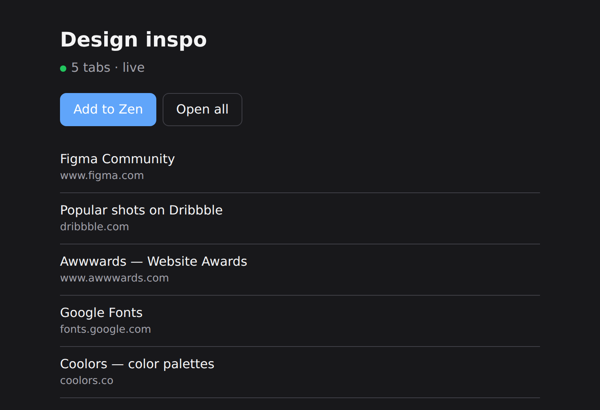
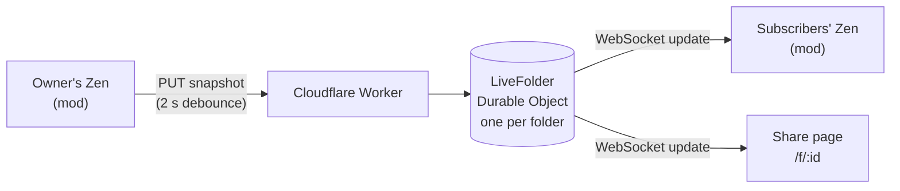

<div align="center">


# Shareable Folders for Zen

**Share a Zen folder as a link. Everyone who adds it sees your changes, live.**

Like Arc's shared folders, for [Zen Browser](https://zen-browser.app).


</div>

---

## What it does

1. **You share.** Right-click a folder → **Share live folder**. A link is copied.
2. **Friends add it.** They open the link and click **Add to Zen**. The folder appears in their sidebar.
3. **It stays in sync.** When you add, close, rename or reorder tabs, or rename the folder, their copy updates within seconds.

No mod? The link still works. It opens a page listing the folder's tabs, with an **Open all** button.

<div align="center">

<br><sub>The page a share link opens. It updates live too.</sub>
</div>

> [!NOTE]
> Zen has a built-in **Share** for folders, but it sends a one-time copy. Shareable Folders keeps the folder live.

## Features

- **Live updates** over WebSocket, with polling as a fallback.
- **Live badge** in the sidebar: a green dot on folders you share, a blue dot on folders you follow.
- **Private-URL check.** Before sharing, links that look private (login tokens, `session=`, `localhost`, `192.168.x.x`…) are flagged, and you decide whether to share them.
- **Light on the network.** New tabs arrive unloaded, so adding a 40-tab folder doesn't load 40 pages.
- **Respects the subscriber.** A tab you're reading is never closed from under you, tabs you close stay closed, and tabs you add are left alone.
- **Works offline.** Changes are queued and sent when you're back online. Subscribers catch up when Zen starts.
- **Only the essentials leave your browser:** each tab's URL and title. No history, cookies or page content.

## Install

You need [Zen Browser](https://zen-browser.app) and the [Sine](https://github.com/CosmoCreeper/Sine) mod manager.

1. Install Sine by following the instructions in [its repository](https://github.com/CosmoCreeper/Sine).
2. Open Sine's settings and allow **unofficial/unsafe JS mods**. This mod needs JavaScript to reach folders and talk to the server. The code is small and readable in [`mod/`](mod).
3. In Sine, install from this repository's URL:
   ```
   https://github.com/hajorda/ZenSharableFolders
   ```
4. Restart Zen.

That's it. The mod uses the public server at `https://folder.hajorda.dev`. To use your own server instead, see [Self-hosting](#self-hosting).

## Use it

| To… | Do this |
| --- | --- |
| Share a folder | Right-click the folder → **Share live folder**. The link is copied. |
| Copy the link again | Right-click → **Copy live folder link** |
| Stop sharing | Right-click → **Stop sharing live folder**. Subscribers keep their copy as a normal folder. |
| Follow a shared folder | Open the link → **Add to Zen** in the bar above the page |
| Stop following | Right-click → **Unsubscribe (keep tabs)** |

**Sidebar dots:** 🟢 you share it · 🔵 you follow it · 🟠 sharing is stuck; the message bar at the top of the window says why.

### Good to know

- **The shared URL is the tab's pinned URL.** Browsing inside a shared tab doesn't change what your friends see.
- **Subfolders aren't shared yet.** Only tabs directly in the folder, including split views, are shared.
- **Only the owner edits.** Subscribers can't change the shared folder in this version.
- **Your owner key lives in Zen's password manager** (Settings → Passwords, listed as `chrome://zen-shareable-folders`), on the device you shared from.

## Privacy and security

- **Unguessable links.** Folder ids are 24 random characters. As with Arc, anyone who has the link can view the folder.
- **Only web links.** Only `http` and `https` URLs are accepted, checked by the server and again by each subscriber's mod.
- **Owner key stays private.** The server stores only a hash of your owner key, and the key is only ever sent in a request header.
- **Safe share page.** Everything shown on the share page is escaped, so a tab title can't inject code.
- **Rate limits** keep one client from flooding a folder: 30 updates a minute per folder, 20 new folders an hour per IP.

## How it works



- **Owner side.** The mod watches the tab events of shared folders. It waits about 2 seconds for more changes, then sends a snapshot of the folder with the version it last saw.
- **Server side.** One [Durable Object](https://developers.cloudflare.com/durable-objects/) per folder stores it and pushes each new version to everyone connected.
- **Subscriber side.** The mod compares the new version with its copy, item by item, then adds, removes, renames and reorders tabs.
- **Ordering.** Each item has a stable id and a fractional order key, so moving one tab changes one key.

### API

| Method | Endpoint | What it does | Owner key |
| --- | --- | --- | :---: |
| `POST` | `/api/folders` | Create a folder. Returns `id`, `ownerToken`, `url` | |
| `GET` | `/api/folders/:id` | Current folder JSON | |
| `PUT` | `/api/folders/:id` | Replace contents. Include `baseVersion`; a stale version gets 409 | ✔ |
| `DELETE` | `/api/folders/:id` | Stop sharing. Subscribers receive `{"type":"deleted"}` | ✔ |
| `GET` | `/api/folders/:id/live` | WebSocket: `{"type":"update","folder":…}` | |
| `GET` | `/f/:id` | Share page | |

Send the owner key in the `x-owner-token` header.

<details>
<summary>Folder JSON</summary>

```json
{
  "id": "k7Qp2xVb9mRt4sLwAbCdEfGh",
  "name": "Design inspo",
  "icon": "",
  "version": 12,
  "updatedAt": "2026-09-29T16:00:00Z",
  "items": [
    { "id": "1727600000000-…", "url": "https://example.com", "title": "Example", "order": "V" }
  ]
}
```

</details>

## Self-hosting

The backend fits in Cloudflare's free plan. You need [Node.js](https://nodejs.org) and a Cloudflare account.

```sh
git clone https://github.com/hajorda/ZenSharableFolders.git
cd ZenSharableFolders
npm install
npx wrangler login
```

Then, before deploying:

1. **Choose your address.** In `wrangler.toml`, change the `routes` line to a domain you own on Cloudflare DNS, or delete it to use the free `*.workers.dev` address.
2. **Deploy:** `npm run deploy`. With a custom domain, Cloudflare creates its DNS record and HTTPS certificate.
3. **Point the mod at it.** In Zen, open the mod's settings in Sine and set **Server URL** to your address.

Share links always carry their server's address, so people using different servers can still follow each other's folders.

## Development

```sh
npm run dev    # local server on http://localhost:8787
npm test       # backend API, share page, mod logic, and a two-profile sync simulation
```

| Path | What's there |
| --- | --- |
| [`src/index.js`](src/index.js) | Worker: routing, folder creation, share page |
| [`src/live-folder.js`](src/live-folder.js) | Durable Object: storage, owner-key check, broadcasting |
| [`src/validate.js`](src/validate.js) | Input validation |
| [`src/page.js`](src/page.js) | Share page HTML |
| [`mod/core.uc.js`](mod/core.uc.js) | Pure logic: order keys, diffing, private-URL check |
| [`mod/zen-adapter.uc.js`](mod/zen-adapter.uc.js) | **Every** call into Zen internals |
| [`mod/shareable-folders.uc.js`](mod/shareable-folders.uc.js) | Sharing, pushing, subscribing, live sync |
| [`mod/userChrome.css`](mod/userChrome.css) | Sidebar badges |

**Debugging in Zen:** open the Browser Toolbox (set `devtools.chrome.enabled` and `devtools.debugger.remote-enabled` to `true` in `about:config`). Run `ZSFDebug.loadState()` to see what the mod tracks. Log lines start with `[Shareable Folders]`.

**When Zen updates:** Zen's folder internals change from time to time. Everything the mod relies on is listed at the top of [`mod/zen-adapter.uc.js`](mod/zen-adapter.uc.js), so that is the one file to fix. Try new versions on Zen Twilight first.

## Roadmap

- [x] Share, auto-push, share page, subscribe, live updates, badges, stop/unsubscribe
- [x] Private-URL check
- [ ] Subfolders inside shared folders
- [ ] Invite editors, with per-item last-writer-wins
- [ ] Subscriber count and expiring links
- [ ] Sine marketplace listing

## Contributing

Issues and pull requests are welcome. Please run `npm test` before opening a PR, and keep Zen-specific calls in `mod/zen-adapter.uc.js`.
